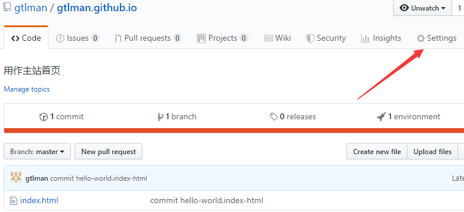
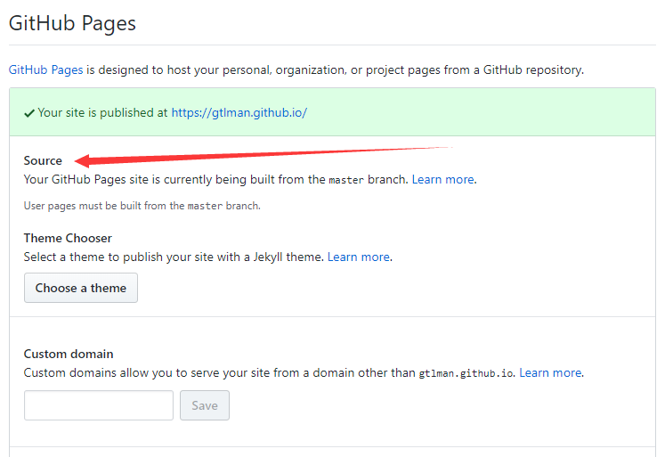

# 
Gitbook

## 简介
`gitBook`是一个基于`node.js`的命令行工具,使用`github/git`和`markdown/asciiDoc`构建精美的电子书
`gitbook`支持输出静态网页和电子书等多种格式,其中默认输出静态网页格式，可以与`git + githup + pages githup`配合实现个人博客
`gitbook`还支持在线编写电子书，不过官网需要翻墙登录

## 本地安装
1. 安装node.js，安装结束执行`node -v`查看是否成功
2. 安装git，后面需要将电子书挂靠在GitHub上，因此需要安装git环境
3. gitbook脚手架：`npm install -g gitbook-cli`(`node.js`自带了`npm`下载工具)

## gitbook命令
1. gitbook init：初始化gitbook环境，第一次执行会生成 `README.md` 和 `SUMMARY.md`，后面修改了目录文件`SUMMARY.md`再执行会生成相应的markdown文件（.md结尾）
2. gitbook build：输出静态文件，默认输出到`_book`目录
3. gitbook serve：启动本地服务器，可以查看电子书效果，会自动输出静态文件到`_book`目录

## gitbook文件组成说明
1. `README.md `是默认首页文件,相当于网站的首页` index.html `,一般是介绍文字或相关导航链接.
2. `SUMMARY.md `是默认概括文件,主要是根据该文件内容生成相应的目录结构,同` README.md `一样都是被`gitbook init `初始化默认创建的重要文件.
3. `_book `是默认的输出目录,存放着原始` markdown `渲染完毕后的` html `文件,可以直接打包到服务器充当静态网站使用.一般是执行` gitbook build `或` gitbook serve `自动生成的.
4. `book.json `是配置文件,用于个性化调整` gitbook `的相关配置,如定义电子书的标题,封面,作者等信息.虽然是手动创建但一般是必选的.在` gitbook `根目录下新建` book.json `配置文件
5. `GLOSSARY.md `是默认的词汇表,主要说明专业词汇的详细解释,这样阅读到专业词汇时就会有相应提示信息,也是手动创建但是可选的.
6. `LANGS.md `是默认的语言文件,用于国际化版本翻译,和` GLOSSARY.md `一样是手动创建但是可选的.

## 发布电子书
发布电子书需要利用到`GitHub`提供的`GitHub pages`静态网页服务，`GitHub pages`允许发布`GitHub`的静态网页，而`gitbook`的`gitbook build`可以输出静态网页，因此可以将输出的电子书发布到免费的`GitHub pages`上
### GitHub pages的主站 和 项目站点
#### 主站
每个账号有且只有一个主站。

在`GitHub`上创建一个名为`<username>.github.io`的公开版本库，名字必须是这个格式

然后仓库根目录下必须要有一个`index.html`作为首页

然后设置`GitHub pages`的源码分支，如下：

主站链接：[https://gtlman.github.io](https://gtlman.github.io "主站")

### 项目站点

例如我有四个公开库需要作为电子书发布：

`gtlman.github.io`是主站，`book_git`，`book_redis`，`book_database`是三个项目站点

首先需要将电子书输出为静态网页：`gitbook build`

默认会输出到`_book`目录

将`_book`下的文件全部拷贝到根目录下，然后`git pull`到`GitHub`上

然后跟主站一样设置`GitHub pages`即可

项目站点的链接：

[https://gtlman.github.io/book_git/](https://gtlman.github.io/book_git/ "git电子书")

[https://gtlman.github.io/book_redis/](https://gtlman.github.io/book_redis/ "redis电子书")

[https://gtlman.github.io/book_database/](https://gtlman.github.io/book_database/ "数据库电子书")

可以看到 主站 和 项目站点 URL的 主次性质